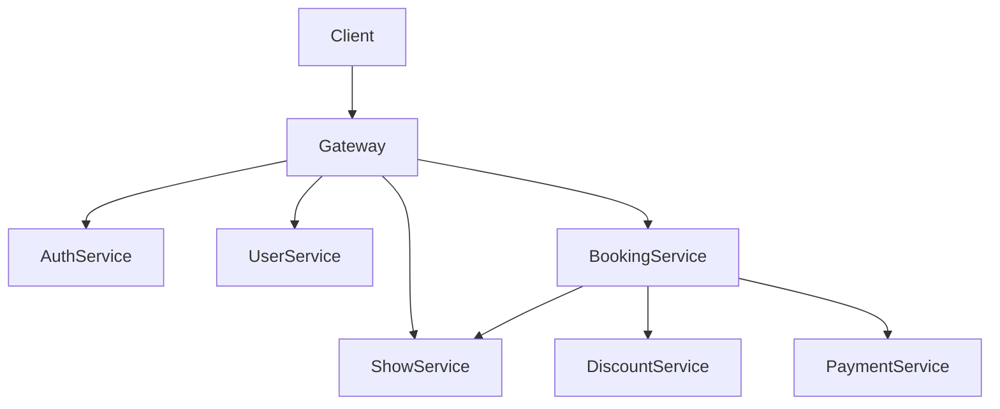
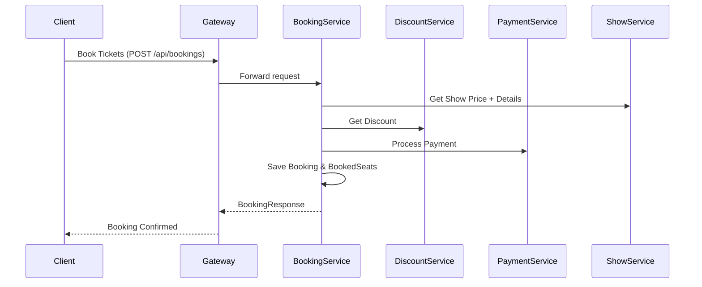

# Movie Ticket Booking Platform - API & Architecture Documentation

---

##  Microservices Overview

- **gateway-service**: API Gateway with JWT auth, RBAC, and logging
- **auth-service**: JWT-based authentication, user registration & login
- **user-service**: Manages user profile info
- **movie-service**: Manages movie metadata
- **theatre-service**: Manages theatres and locations
- **show-service**: Manages shows, seat pricing
- **booking-service**: Manages seat selection, booking logic
- **discount-service**: Applies category/time-based discount
- **payment-service**: Processes payment requests

---

##  Authentication APIs (auth-service)

| Method | Endpoint | Description |
|--------|----------|-------------|
| POST   | `/api/auth/register` | Register a new user |
| POST   | `/api/auth/token`    | Login and get JWT token |

---

##  Show APIs (show-service)

| Method | Endpoint | Description |
|--------|----------|-------------|
| POST   | `/api/shows`         | Create a new show with seat category pricing |
| GET    | `/api/shows/{id}`    | Get show details including category pricing |

---

##  Booking APIs (booking-service)

| Method | Endpoint | Description |
|--------|----------|-------------|
| POST   | `/api/bookings`                 | Book tickets (with seat category & pricing) |
| GET    | `/api/bookings/available-seats` | Get available seats by show and category |

---

##  Discount APIs (discount-service)

| Method | Endpoint | Description |
|--------|----------|-------------|
| POST   | `/api/discounts` | Calculate discount based on seat categories and time |

---

##  Payment APIs (payment-service)

| Method | Endpoint | Description |
|--------|----------|-------------|
| POST   | `/api/payments` | Simulate payment and return status |

---

## 🗄️ Database Schemas (Key Tables)

### `user-service`:
```sql
CREATE TABLE users (
    id BIGINT PRIMARY KEY,
    username VARCHAR,
    password VARCHAR,
    role VARCHAR
);
```

###  `show-service`:
```sql
CREATE TABLE show (
    id BIGINT PRIMARY KEY,
    movie_id BIGINT,
    theatre_id BIGINT,
    date DATE,
    time TIME,
    total_seats INT,
    available_seats INT
);

CREATE TABLE show_seat_price (
    id BIGINT PRIMARY KEY,
    show_id BIGINT,
    category VARCHAR,
    price DECIMAL
);
```

### `booking-service`:
```sql
CREATE TABLE booking (
    id BIGINT PRIMARY KEY,
    user_id BIGINT,
    show_id BIGINT,
    seat_numbers TEXT,
    number_of_tickets INT,
    total_amount DECIMAL,
    discount_amount DECIMAL,
    status VARCHAR
);

CREATE TABLE booked_seat (
    id BIGINT PRIMARY KEY,
    show_id BIGINT,
    seat_number VARCHAR
);
```

---

##  System Architecture 



---

##  Booking Flow Diagram 




##  Additional Supporting Services

To complete the architecture, the following services can be added:

---

###  notification-service

- Sends booking confirmation emails or SMS
- Can integrate with Kafka (SNS + SQS) for async delivery
- APIs:
  - `POST /api/notify/email` - Send email notification
  - `POST /api/notify/sms` - Send SMS notification

---

###  authorization-service

- Manages role-based permissions (optional if not using stateless JWT)
- Maintains policy rules per role
- Could integrate with OAuth2 or Keycloak if needed

---

###  metric-analytics-service

- Tracks and stores aggregated data:
  - Total bookings per day
  - Revenue per movie/show
  - Discount usage patterns
- Exposes APIs or dashboards for insights
- Stores data in a time-series DB (e.g., Prometheus, InfluxDB)

---


---

## Alternative Approach ( [Event Driven Architecture](event-driven-architecture.md) )

- `booking-service` can publish booking events to Kafka → consumed by `notification-service` and `metric-analytics-service`
- `gateway-service` can log request traces to `metric-analytics-service`
- `authorization-service` (if implemented) can enhance gateway token validation


---

