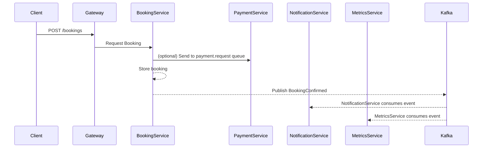

# Alternative Architecture: Event-Driven Booking Platform (Kafka / SNS+SQS)

---

## Why Event-Driven?

Moving to an event-driven architecture offers:

- Loose coupling between services
- Improved scalability and fault tolerance
- Async workflows like notifications, analytics, retries
- Support for auditing, replayability, and observability


[Event Driven Architecture](./event-driven-architecture.md)

---

## Core Changes

| Feature              | Current Approach             | Event-Driven Approach                |
|----------------------|------------------------------|--------------------------------------|
| Booking confirmation | Synchronous REST to services | Publish `BookingConfirmed` event     |
| Notification         | Called via HTTP              | Consumes from `booking.events` topic |
| Metrics collection   | Embedded in booking-service  | Subscribes to events for analytics   |
| Payments             | Direct REST call             | Optional async via payment queue     |

---

## Event Topics / Queues

| Topic / Queue         | Description                              | Published By        | Consumed By                  |
|------------------------|------------------------------------------|----------------------|-------------------------------|
| `booking.events`       | Contains events like BookingConfirmed    | booking-service      | notification, metrics         |
| `payment.request`      | Used for decoupled payment orchestration | booking-service      | payment-service               |
| `notification.email`   | Email/SMS event                           | booking-service      | notification-service          |

---

##  BookingConfirmed Event Payload

```json
{
  "bookingId": 101,
  "userId": 1,
  "showId": 202,
  "seatNumbers": ["S1", "S2"],
  "amount": 500,
  "timestamp": "2025-07-02T12:30:00Z"
}
```

---

## Booking Flow (Async Orchestration)



---

## Tech Stack Options

| Use Case     | Kafka Alternative      | AWS Alternative (Serverless) |
|--------------|------------------------|-------------------------------|
| Event Bus    | Apache Kafka | Amazon SNS                    |
| Queue Buffer | Kafka        | Amazon SQS                    |
| Delivery     | Kafka consumer group   | Lambda function               |

---

##  Steps to Re-Architect

1. Identify key domain events (e.g., BookingConfirmed, PaymentFailed)
2. Introduce Kafka producers (e.g., in `booking-service`)
3. Introduce Kafka consumers (e.g., `notification`, `metrics`)
4. Replace direct REST dependencies where async is safe
5. Add retry + DLQ logic in consumers

---

## Security & Auditability

- All events are persisted in Kafka (or via Kinesis/S3 in AWS)
- Enable audit trails for compliance
- Can replay topics for recovery or analytics

---

##  Monitoring

- Use Kafka topics + consumer group lag for health
- Monitor retries, failed events, and delays
- Use Prometheus/Grafana or AWS CloudWatch


---


---
